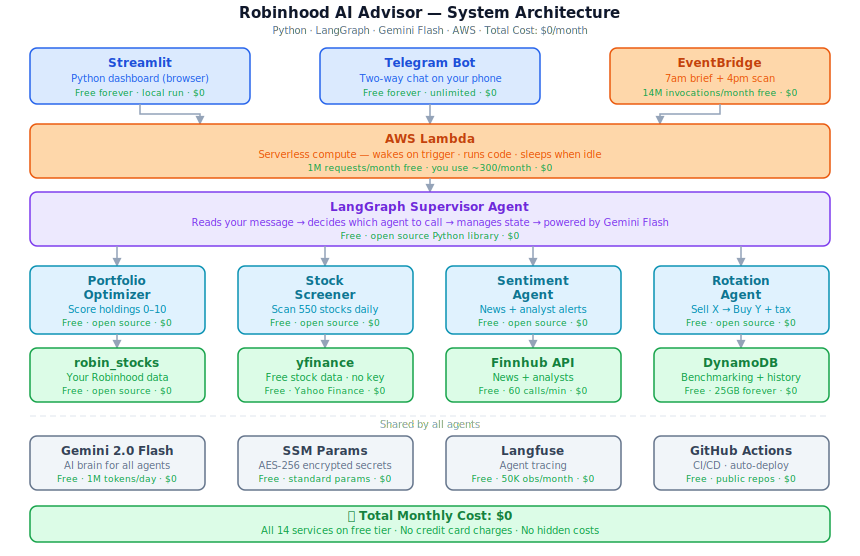

# 🤖 Robinhood AI Advisor

An AI-powered stock portfolio management system that scores your holdings,
finds rotation opportunities, and delivers daily insights via Streamlit
dashboard and Telegram chat.



---

## What it does

- Scores every stock you own on three signals — fundamentals, momentum, sentiment
- Finds weak holdings and suggests better replacements with tax impact
- Delivers a 7am morning brief to your Telegram every day
- Two-way Telegram chat — ask anything about your portfolio
- Benchmarks your returns against S&P 500 (VOO) to measure app performance
- Stop-loss alerts when any holding drops 15%

---

## Scoring System

Every stock gets three scores combined into one final score from 0 to 10.

| Signal | Weight | What it checks |
|---|---|---|
| **F** Fundamental | 40% | Revenue growth, earnings, PE ratio, profit margin |
| **M** Momentum | 35% | 50/200-day moving averages, RSI, 52-week performance |
| **S** Sentiment | 25% | Analyst buy/sell/hold recommendations (Finnhub) |

**Categories:**
- `7.0+` → **HOLD** — strong, keep it
- `5.0–6.9` → **WATCH** — monitor closely
- `below 5.0` → **ROTATE** — consider selling

**Example output:**
```
GOOGL  9.29/10  HOLD    F:9.5  M:10.0  S:7.96
NVDA   9.13/10  HOLD    F:9.0  M:10.0  S:8.13
AAPL   7.68/10  HOLD    F:8.0  M:7.5   S:7.41
FISV   4.96/10  ROTATE  F:6.0  M:3.0   S:6.05
```

---

## Tech Stack

| Component | Technology | Cost |
|---|---|---|
| Dashboard | Streamlit | Free |
| Chat + Alerts | Telegram Bot API | Free |
| Serverless Compute | AWS Lambda | Free (1M req/month) |
| Scheduler | AWS EventBridge | Free (14M/month) |
| Database | AWS DynamoDB | Free (25GB) |
| Secrets | AWS SSM Parameter Store | Free |
| AI Orchestration | LangGraph | Free (open source) |
| AI Brain | Gemini 2.0 Flash | Free (1M tokens/day) |
| Portfolio Data | robin_stocks | Free (open source) |
| Stock Data | yfinance | Free (no key needed) |
| Analyst Data | Finnhub API | Free (60 calls/min) |
| Observability | Langfuse | Free (50K obs/month) |
| CI/CD | GitHub Actions | Free (public repo) |
| **Total** | | **$0/month** |

---

## Project Structure

```
robinhood-ai-advisor/
├── config.py                        ← loads all env vars from .env
├── requirements.txt
├── .env.example                     ← copy to .env and fill in keys
├── .gitignore
│
├── data/
│   ├── yfinance_client.py           ← free stock data, no API key
│   ├── finnhub_client.py            ← analyst recommendations + earnings
│   └── robinhood_client.py          ← reads your real Robinhood portfolio
│
├── scoring/
│   ├── fundamental_scorer.py        ← F score: PE, revenue, earnings
│   ├── momentum_scorer.py           ← M score: MA, RSI, 52-week
│   ├── sentiment_scorer.py          ← S score: analyst recommendations
│   └── engine.py                    ← combines F+M+S into final score
│
├── portfolio/
│   ├── reader.py                    ← parses your holdings
│   ├── rotation_engine.py           ← finds sell X → buy Y candidates
│   ├── tax_calculator.py            ← short vs long term tax impact
│   └── benchmarking.py              ← tracks alpha vs S&P 500
│
├── agents/
│   ├── supervisor.py                ← LangGraph orchestrator
│   ├── portfolio_agent.py
│   ├── screener_agent.py
│   ├── sentiment_agent.py
│   └── rotation_agent.py
│
├── notifications/
│   ├── telegram_bot.py              ← two-way chat + admin commands
│   └── morning_brief.py             ← 7am daily digest
│
├── dashboard/
│   └── app.py                       ← Streamlit UI
│
├── infra/
│   ├── lambda_handler.py            ← AWS Lambda entry point
│   ├── dynamo_store.py
│   └── serverless.yml
│
├── scripts/
│   ├── setup.py                     ← start everything: python scripts/setup.py
│   └── teardown.py                  ← stop everything: python scripts/teardown.py
│
├── docs/
│   └── architecture.svg
│
└── tests/
    ├── test_scoring.py
    └── test_rotation.py
```

---

## Build Phases

| Phase | What | Status |
|---|---|---|
| Phase 1 | yfinance + fundamental + momentum scoring | ✅ Done |
| Phase 2 | Finnhub sentiment + Robinhood connector + rotation engine | 🔄 In progress |
| Phase 3 | Streamlit dashboard + Telegram chat | ⏳ Pending |
| Phase 4 | AWS Lambda + EventBridge + DynamoDB | ⏳ Pending |

---

## Setup

### 1. Clone and create environment
```bash
git clone https://github.com/mrsanketh/robinhood-ai-advisor.git
cd robinhood-ai-advisor
conda create -n robinhood-ai python=3.12
conda activate robinhood-ai
```

### 2. Install Phase 1 + 2 dependencies
```bash
pip install yfinance==1.4.0 pandas==3.0.3 numpy==2.4.6 \
            python-dotenv==1.2.2 requests==2.34.2 \
            robin-stocks==3.4.0 finnhub-python==2.4.28
```

### 3. Set up your API keys
```bash
cp .env.example .env
# open .env and fill in your keys
```

Free API keys needed:
- **Finnhub** — https://finnhub.io (free, no credit card)
- **Gemini** — https://aistudio.google.com (free, 1M tokens/day)
- **Telegram** — create bot via @BotFather on Telegram (free)

### 4. Run the scoring engine
```bash
python -c "
from scoring.engine import score_portfolio
results = score_portfolio(['NVDA', 'GOOGL', 'AAPL', 'MSFT'])
for r in results:
    print(f'{r[\"ticker\"]}  {r[\"final_score\"]}/10  {r[\"category\"]}')
"
```

---

## Telegram Commands

After deployment, control everything from Telegram:

```
/status    — show what is running
/pause     — stop daily briefs
/resume    — restart daily briefs
/teardown  — remove everything (asks for YES confirmation)
/help      — list all commands
```

Or just ask anything:
```
"How is NVDA doing?"
"What should I sell?"
"How much did I make this month?"
"Show me my portfolio score"
```

---

## Security

- All API keys stored in AWS SSM Parameter Store (AES-256 encrypted)
- `.env` is in `.gitignore` — never committed to GitHub
- Lambda IAM role uses minimum permissions only
- Robinhood credentials used once to generate token, then stored encrypted

---

## Disclaimer

This project is for educational purposes only. Not financial advice.
Always do your own research before making investment decisions.

---

## Author

Sanketh Kumar Divveda · [GitHub](https://github.com/mrsanketh)
